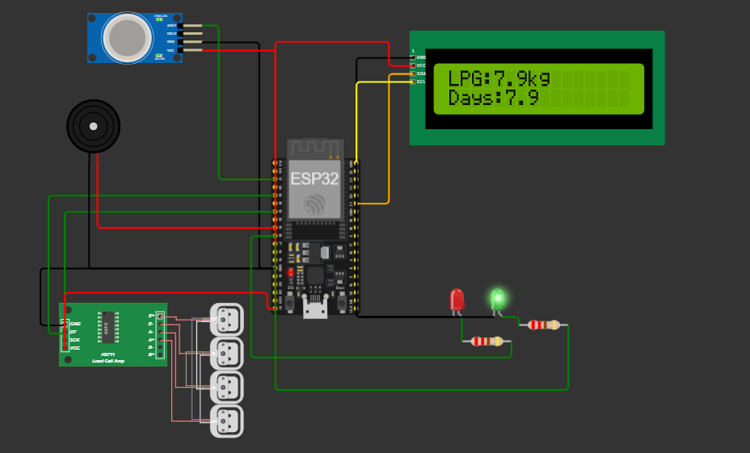
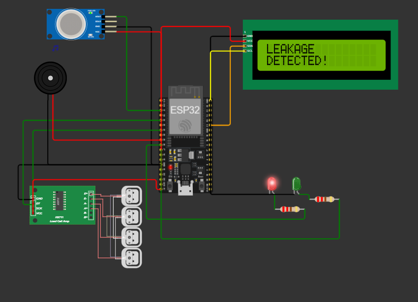
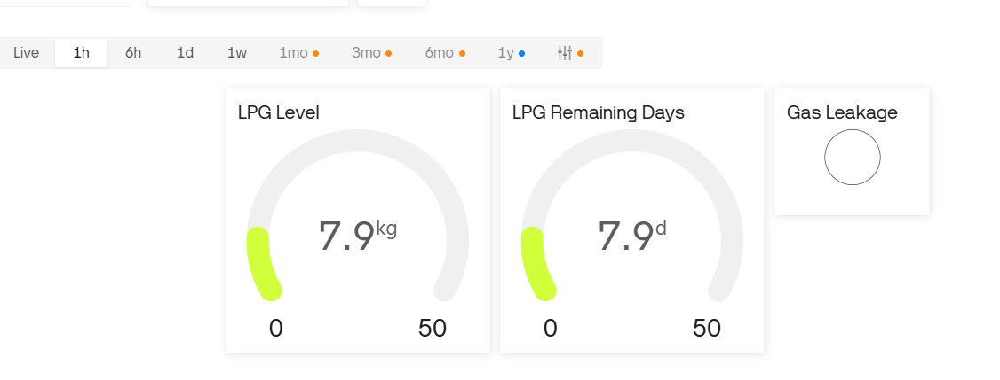

# Smart LPG Monitoring System

An IoT-based LPG monitoring system developed using ESP32 to monitor LPG cylinder weight in real time and provide alerts when the LPG level is critically low.

## Features

- Real-time LPG weight monitoring
- Load-cell based measurement
- HX711 signal amplification
- ESP32-based processing
- LCD display
- Blynk IoT mobile monitoring
- Low LPG alert
- Gas leakage alert
- Real-time data visualization

## Hardware

- ESP32
- Load Cell
- HX711 Load Cell Amplifier
- Gas Sensor
- I2C LCD
- Buzzer
- LEDs
- LPG Cylinder
- Jumper Wires
- Power Supply

## Software

- Arduino IDE
- Embedded C/C++
- Blynk IoT

## System Architecture

Load Cell → HX711 → ESP32 → Blynk IoT
                         ↓
                       LCD
                         ↓
                    Alert System

## Project Images

### Circuit

### Gas Leakage

### Blynk Dashboard

## Working

The load cell measures the weight of the LPG cylinder. The HX711 amplifies and converts the load-cell signal, which is then processed by the ESP32.

The ESP32 calculates the approximate LPG level and displays the information on the LCD and Blynk dashboard.

When the LPG level reaches a predefined threshold, the system generates an alert to notify the user.

## Future Improvements

- LPG consumption prediction
- Remaining-days prediction using historical consumption
- Mobile notification improvements
- Cloud-based data analytics
- Automatic LPG booking
- AI-based consumption forecasting

## Author

Naveen Udatha
